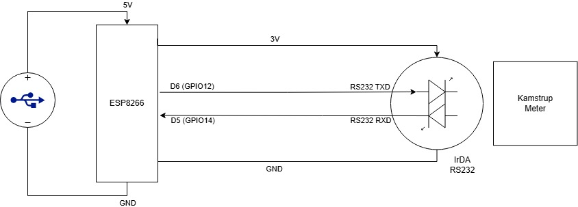
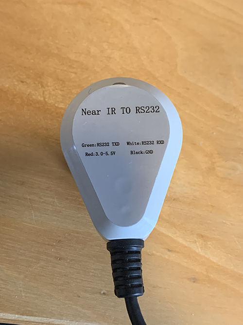
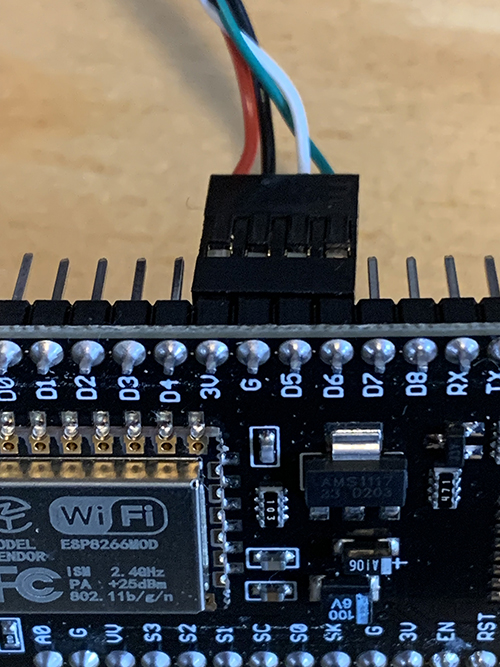
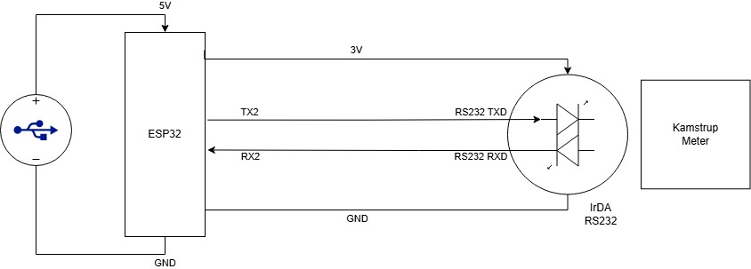

# Setting Up Kamstrup Meter in ESPHome via Python

This guide will help you set up a Kamstrup meter with ESPHome using Python.

## Prerequisites

- ESPHome installed on your system. You can install it using pip:
  ```sh
  pip install esphome
  ```
- A Kamstrup meter with an IR interface.
- An ESP8266 or ESP32 board.
- A RS232 IrDA transceiver module.
- Python 3.6 or later.

## Setting Up the Hardware

### Hardware (ESP8266)

Power the ESP Module with USB, and power the IR Eye with the 3V Power from the Devkit.

<div style="display: flex; justify-content: space-around;">
  
  
</div>

### Hardware (ESP32)

Power the ESP Module with USB, and power the IR Eye with the 3V Power from the Devkit.

## Setting Up the Software

### First time setup
1. Upload the configuration to the ESP module using USB or UART.
  ```sh
  esphome upload kamstrup_espxxx.yaml
  ```

### Updating the configuration
1. Compile the configuration.
  ```sh
  esphome compile kamstrup_espxxx.yaml
  ```
2. Upload the firmware.bin via the web interface.
   1. Open the web interface of the ESP module.
   2. Find the firmware.bin file in the `.pioenvs` folder.
